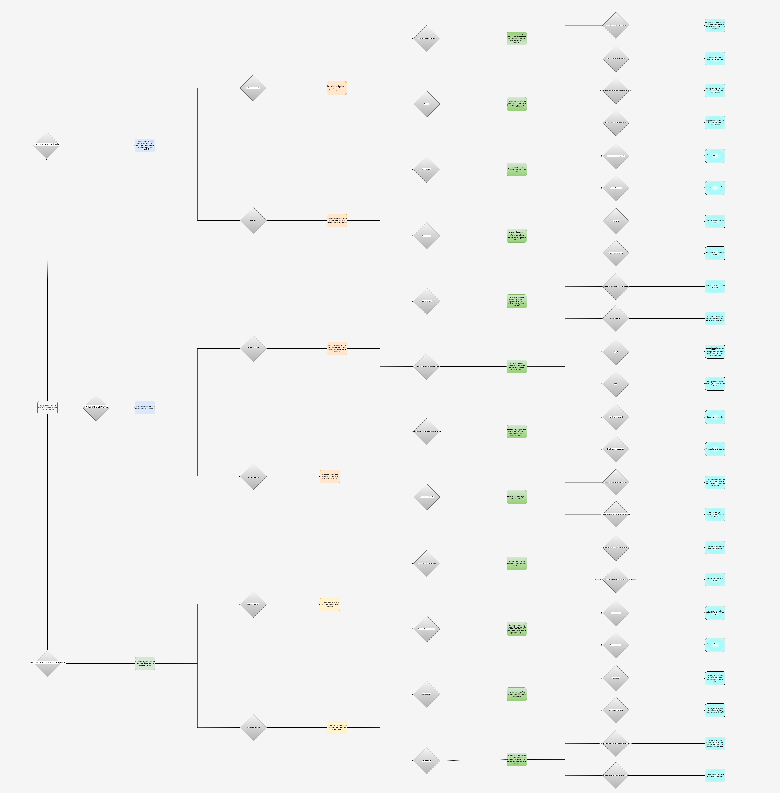

# Projet 1

## Description

Jeu interactif avec des options qui déterminent le déroulement d'une histoire à propos d'un papillon.

---
## Comment Jouer
1. Installer Python
2. Installer VS Code
3. Ouvrir le projet dans VS code
4. Exécute Cassey/projet.py
5. Lisez l'histoire dans le terminal
6. Suivez les instructions pour entrez votre choix parmis les options
7. Répétez les étapes 5 et 6 jusqu'à la fin de l'histoire
---
## Histoire

L'histoire est sous forme d'un arbre, montant a 24 histoires différentes et 45 choix possibles à travers celle-ci.

**Voici l'histoire sous forme d'arbre:** 

