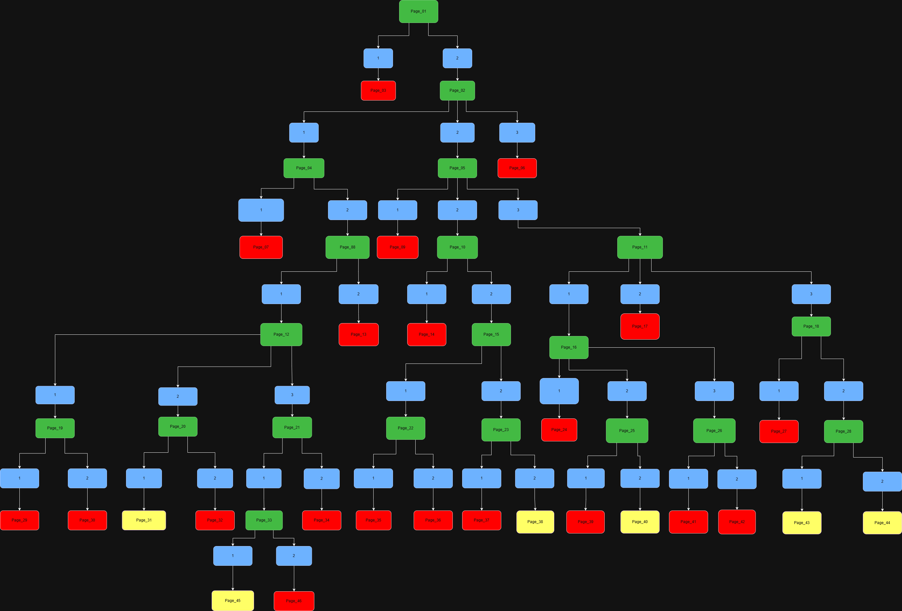

# PROJET 01
- Un livre dont vous êtes le héros.
## THÉMATIQUE
### Employé modèle
- Bravo! Vous avez menti sur votre CV et avez eu le job. Seul problème, vous êtes gravement sous-qualifié et ne savez absolument pas ce que vous faites. Tentez de survivre ce premier quart de travail sans soulever les soupçons de votre patron méfiant.
---
# COMMENT JOUER
## ENTRÉE
### Système de choix sous forme de chiffres:

- À chaque page, une situation vous sera décrite. À la fin de cette même page, deux ou trois choix s'offriront à vous: le choix 1, le choix 2 ou le choix 3. Vous pourrez alors inscrire le chiffre correspondant à votre décision.

## SORTIE
- Votre choix vous envoie vers une prochaine page où une nouvelle situation et d'autres choix vous seront proposés.

# CONTRÔLE
### **Structure en arbre:**

- Chaque décision vous fait progresser tranquillement dans l'histoire et vous emmène vers une nouvelle situation unique. Aucun chemin n'est le même et aucune décision ne vous apportera au même endroit.

# À FAIRE
- Ajouter du contenu à l'histoire ainsi que de nouveaux choix possibles.
  

# *CHEAT SHEET*

